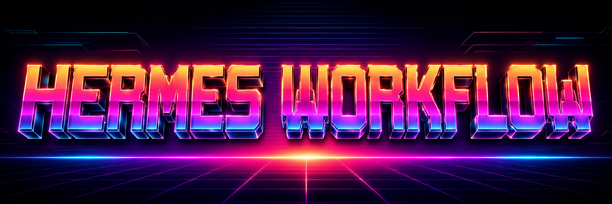

<p align="center">
  
</p>

# Hermes Workflow

<p align="center">
  <a href="https://hermes-agent.nousresearch.com/docs/"></a>
  <a href="https://discord.gg/NousResearch"></a>
  <a href="https://github.com/NousResearch/hermes-agent/blob/main/LICENSE"></a>
  <a href="https://nousresearch.com"></a>
  <a href="README.zh-CN.md"></a>
</p>

Hermes Workflow is a workflow-first AI agent workbench derived from Hermes Agent. It keeps the Hermes Agent runtime, models, tools, and skills as the execution foundation, then adds a project-oriented Workflow Workbench app for planning, visualizing, running, reviewing, and preserving multi-step AI work.

Instead of treating every job as one long chat, Hermes Workflow turns a goal into a project: clarify the requirements, generate an executable node graph, bind references and skills to each node, run nodes with visible state, review file changes and artifacts, and checkpoint the project as it evolves.

## What is Hermes Workflow?

Hermes Workflow is built for work that needs structure, auditability, and human control:

- **Project-first interaction**: every workflow has a project root, goal, references, generated plan, run history, artifacts, and snapshots.
- **Visual agent orchestration**: the desktop workbench shows the workflow as a node graph with dependencies, success paths, and failure/return paths.
- **Hermes Agent execution**: each node can run through the underlying Hermes Agent runtime while inheriting configured providers, models, tools, and skills.
- **Reviewable outputs**: node results are written as Markdown artifacts, file changes are summarized for review, and stream events preserve what happened during execution.
- **Recoverable progress**: workflow metadata is stored in readable project files plus a local event database, with Git snapshots created around important milestones.

## What can Hermes Workflow do?

| Capability | What it means in practice |
| --- | --- |
| Goal intake and clarification | Start with a project name, goal, optional root, and references. Hermes asks planning questions before generating the workflow. |
| Generated node graph | The workbench creates editable planning, reference, execution, review, and delivery nodes with dependency edges. |
| References | Add project-level and node-level files or folders so enabled materials enter the right execution context. |
| Skill bindings | Let Hermes choose skills automatically or bind selected skills manually for a node. |
| Node prompt and model control | Inspect and edit each node's execution prompt, and optionally override the model for that node. |
| Execution control | Run the workflow in `single_step`, `semi_auto`, or `auto` mode with pause, resume, stop, retry, skip, pass, fail, and return controls. |
| Review gates | Require human confirmation for selected nodes, route failures through feedback edges, or allow structured automatic review decisions in auto mode. |
| Stream output | Watch process summaries, tool calls, stage results, AI replies, node status changes, approvals, errors, and snapshots as live events. |
| Artifact and file review | Review node Markdown artifacts and inspect new, modified, deleted, or binary business files after node execution. |
| Snapshots and export | Create Git-backed project snapshots and export a workflow project as a portable zip without heavy runtime files. |

## Workflow Workbench App

The desktop app is the primary Hermes Workflow surface. Open **Workflow Workbench** from the sidebar or navigate to `/workflows` in the desktop shell.

The app is organized around these UI regions:

- **Project sidebar**: browse workflow projects, create new workflows, reopen project roots, rename, archive, remove from history, or export.
- **New Workflow intake**: enter the task background, choose a project directory, add references, answer clarification questions, then confirm generation.
- **Canvas**: inspect and edit the workflow graph, move nodes, connect success/failure ports, and follow the currently running node.
- **Execution toolbar**: choose `single_step`, `semi_auto`, or `auto`, then run, pause, resume, or stop the current workflow.
- **Node detail drawer**: inspect node status, prompt, model, skills, references, review rules, review decisions, artifacts, and file changes.
- **References and skills drawers**: manage the project context and skill availability without leaving the workbench.
- **Snapshots drawer**: create manual snapshots and inspect previous workflow checkpoints.
- **Project file tree**: browse workflow project files such as references, workflow metadata, artifacts, outputs, and logs.
- **Stream output**: follow live execution events and AI replies in a dedicated stream panel rather than scattered chat bubbles.
- **Workflow composer**: send project-level or node-level instructions, slash commands, and file attachments back into the workflow.

### UI showcase placeholders

The README intentionally uses non-rendering placeholders until real product screenshots are committed.

| Slot | Intended future asset | Alt text / caption |
| --- | --- | --- |
| Workbench overview | `docs/assets/workflow-workbench-overview.png` | Hermes Workflow Workbench showing the project sidebar, workflow canvas, node drawer, and stream output. |
| Intake and clarification | `docs/assets/workflow-intake-clarification.png` | New Workflow intake screen with project configuration, clarification questions, and planning summary. |
| Canvas execution | `docs/assets/workflow-canvas-execution.png` | Workflow graph running in semi-auto mode with the current node highlighted. |
| Node review drawer | `docs/assets/workflow-node-review-drawer.png` | Node detail drawer showing review controls, artifacts, file changes, references, and skills. |
| Stream and artifacts | `docs/assets/workflow-stream-artifacts.png` | Stream output panel with tool calls, AI replies, stage results, snapshots, and generated artifacts. |

See the desktop-specific README for more details: [apps/desktop/README.md](apps/desktop/README.md).

## Workflow execution modes

Hermes Workflow currently exposes three run modes:

- `single_step`: execute one node and wait for user confirmation before continuing.
- `semi_auto`: continue through ordinary nodes, but pause at review gates or nodes that require confirmation.
- `auto`: let the workflow engine continue automatically and apply structured review decisions when possible.

All modes preserve explicit user controls for pause, resume, stop, retry, skip, pass, fail, and return. Review and failure paths are first-class workflow edges, so a failed review can send work back to an earlier node instead of ending the run.

## Project files and persistence

When no custom root is chosen, projects are created under:

```text
HERMES_HOME/workflows/<project-slug>
```

Each workflow project keeps its state under `.agent-workflow/`:

```text
.agent-workflow/
  project.json
  workflow.flow.json
  references.manifest.json
  skills.config.json
  settings.json
  artifacts.manifest.json
  workflow.db
  intake.state.json
  stream-events/YYYY-MM-DD.jsonl
```

Generated work is stored in project directories such as `artifacts/`, `outputs/`, `logs/`, `references/`, and `workflow/`. Git snapshots are created after project initialization, workflow generation, workflow edits, node completion, review transitions, and final delivery when Git is available.

## Install / Run

Hermes Workflow still uses the existing Hermes install and command names while the workflow-first app is developed.

### Linux, macOS, WSL2, Termux

```bash
curl -fsSL https://hermes-agent.nousresearch.com/install.sh | bash
```

### Windows PowerShell

```powershell
iex (irm https://hermes-agent.nousresearch.com/install.ps1)
```

After installation:

```bash
hermes setup
hermes model
hermes desktop
```

The desktop app can also be installed with the agent in one step:

```bash
curl -fsSL https://hermes-agent.nousresearch.com/install.sh | bash -s -- --include-desktop
```

## Development

From the repository root:

```bash
curl -LsSf https://astral.sh/uv/install.sh | sh
uv venv .venv --python 3.11
source .venv/bin/activate
uv pip install -e ".[all,dev]"
npm install
```

Run the desktop workbench:

```bash
cd apps/desktop
npm run dev
```

Useful checks:

```bash
scripts/run_tests.sh
cd apps/desktop
npm run type-check
npm run lint
npm run test:desktop:all
```

For a disposable workflow home during development:

```bash
HERMES_HOME=/tmp/hermes-workflow-dev npm run dev
```

## License

MIT - see [LICENSE](LICENSE).

Hermes Workflow Workbench Built by [AbnerWater](https://github.com/AbnerWater).

Hermes Agent Built by [Nous Research](https://nousresearch.com).
